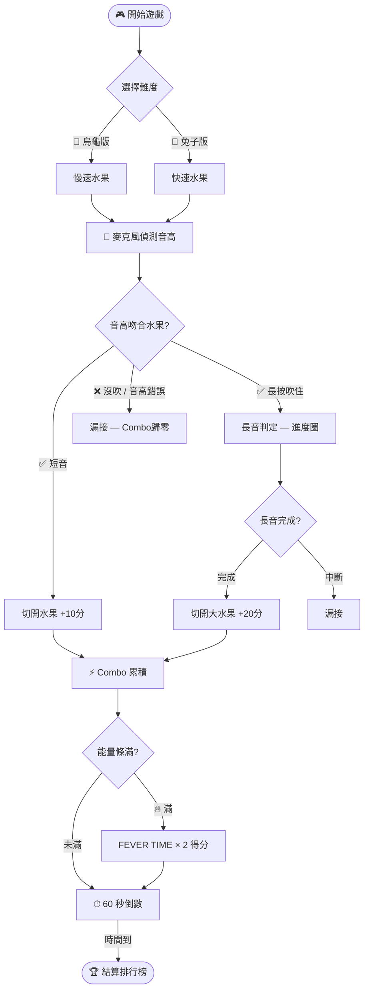
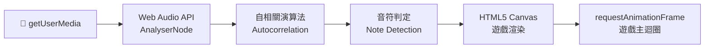

# 🎵 直笛水果忍者 Wind-Blade

> **吹對音高，切開水果！**  
> Blow the right note on your recorder to slash the fruit!


---

## 🎮 遊戲介紹 / About

《直笛水果忍者》是一款以**麥克風音高偵測**驅動的網頁街機遊戲。  
玩家吹奏高音直笛（Sol / La / Si / Do），系統即時辨識音高，讓對應的水果被「切開」。

*Wind-Blade is a browser arcade game driven by real-time microphone pitch detection. Players blow a recorder (Sol / La / Si / Do) and the matching fruit gets slashed on screen.*

---

## ✨ 遊戲特色 / Key Features

- 🎤 **麥克風音高辨識** — 自相關演算法（Autocorrelation）即時偵測直笛基頻，支援 Sol・La・Si・Do・高音 Re
- 🎼 **動態音準儀** — 畫面顯示偏高/偏低提示，協助學生穩定氣息
- 🍓 **長音水果機制** — 大顆水果需「按住吹奏」到結尾才計分，訓練長音時值
- 🔥 **FEVER 連擊模式** — 連續切水果累積能量，觸發雙倍積分，超嗨！
- 🐢🐇 **雙難度** — 烏龜版（慢速、新手）／兔子版（快速進階）
- ⏱ **60 秒計時賽** — 限時挑戰，本機儲存 Top 5 英雄榜
- 🖥️ **滿版自適應** — 100vw × 100vh，平板、電子白板都能用

*Features: real-time pitch detection, visual tuner, hold-note fruits, FEVER fever-mode, dual difficulty, 60-second timer, local leaderboard.*

---

## 🕹️ 操作方式 / Controls

| 操作 / Input | 說明 / Description |
|:---|:---|
| 🎤 對麥克風吹直笛 / Blow recorder into mic | 主要操作：吹出對應音名切水果 / Main input |
| `Z` `X` `C` `V` 鍵 | 備用鍵盤操作（對應 Sol La Si Do） |
| `Shift` / `B` 鍵 | 切換難度 |

---

## 🎵 音高對照 / Note Reference

| 音名 / Note | 頻率 / Frequency | 顏色 / Color |
|:---:|:---:|:---:|
| **Sol** | 784 Hz | 🟡 金黃 |
| **La** | 880 Hz | 🟠 橘 |
| **Si** | 988 Hz | 🔴 紅 |
| **Do** | 1047 Hz | 🟢 綠 |
| **Re**（高音） | 1175 Hz | 🟣 紫 |

---

## 🔄 遊戲流程 / Game Flow



---

## 🛠️ 技術架構 / Tech Stack



- **純前端** — 單一 HTML 檔，無需任何框架或後端
- **Web Audio API** — 即時音訊分析，AudioContext + AnalyserNode
- **HTML5 Canvas** — 水果、特效、粒子全部 Canvas 手繪
- **LocalStorage** — 本地儲存排行榜成績

*Pure HTML5 + Web Audio API + Canvas. Zero dependencies, zero build step.*

---

## 📁 專案結構 / File Structure

```
Wind-Blade/
├── index.html    # 遊戲本體（所有邏輯內嵌）/ All-in-one game file
└── icon.jpg      # 遊戲封面圖 / Cover image
```

---

## 🎓 適用場景 / Classroom Use

- 🎵 國小直笛課 — 音高辨識訓練、氣息穩定訓練
- 🏫 課堂暖身 — 開課前 5 分鐘用全班互相比拼分數
- 🏆 家庭自學 — 直笛學習者的趣味自主練習

*Perfect for elementary recorder lessons, classroom warm-ups, and self-practice at home.*

---

## 🔗 連結 / Links

- 🌐 **線上遊玩** — [linyubert.github.io/Wind-Blade](https://linyubert.github.io/Wind-Blade/)
- 💬 **Threads** — [@lycbert](https://www.threads.com/@lycbert)
- 📺 **YouTube** — [@datoemusic](https://www.youtube.com/@datoemusic)

---

*Made with 🎵 by Dato — 國小音樂老師，把直笛課變遊戲。*  
*Elementary music teacher turning recorder class into a game.*
